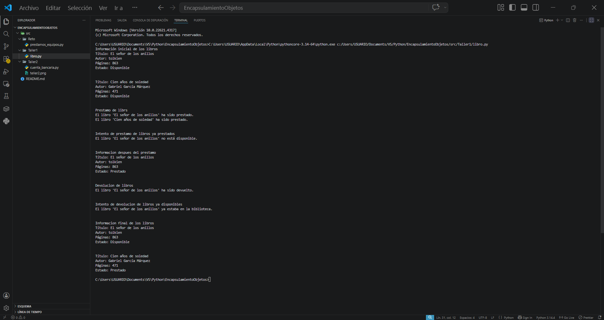
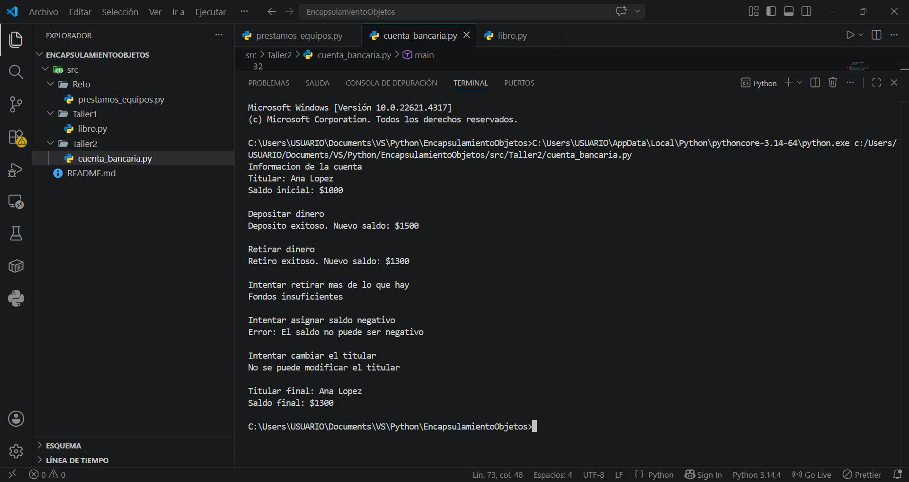
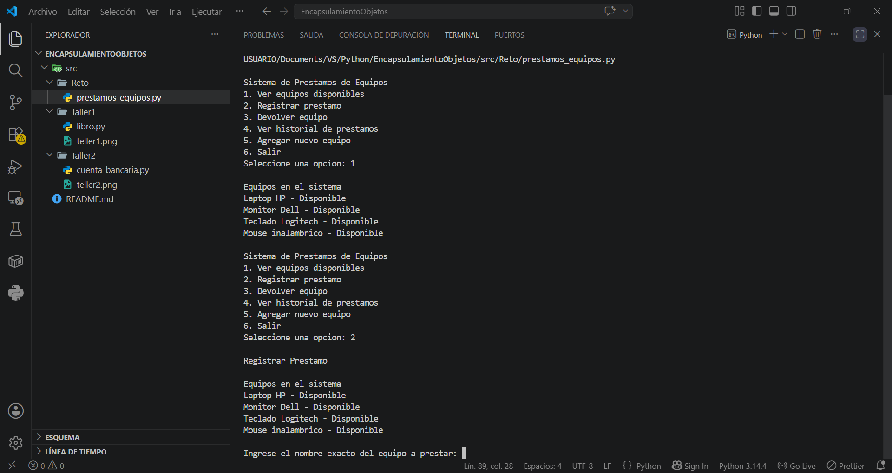
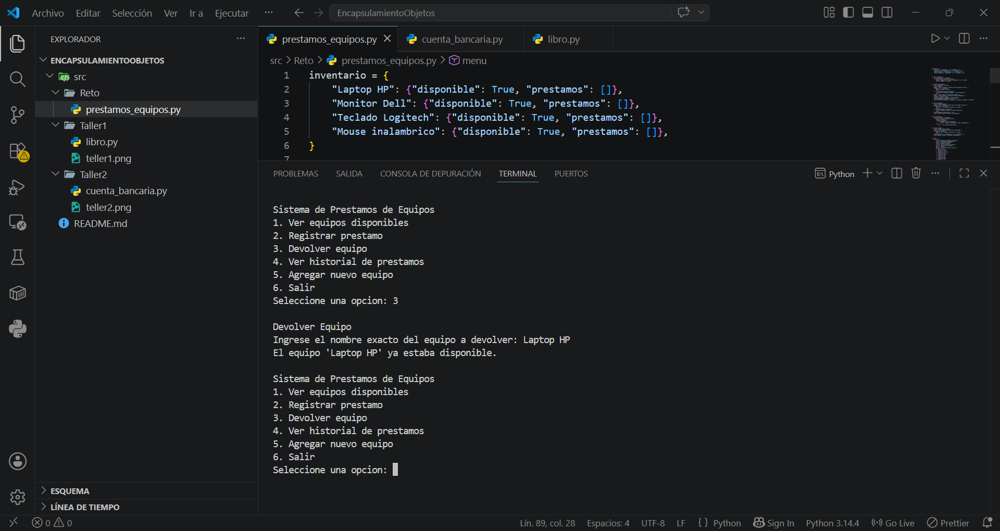
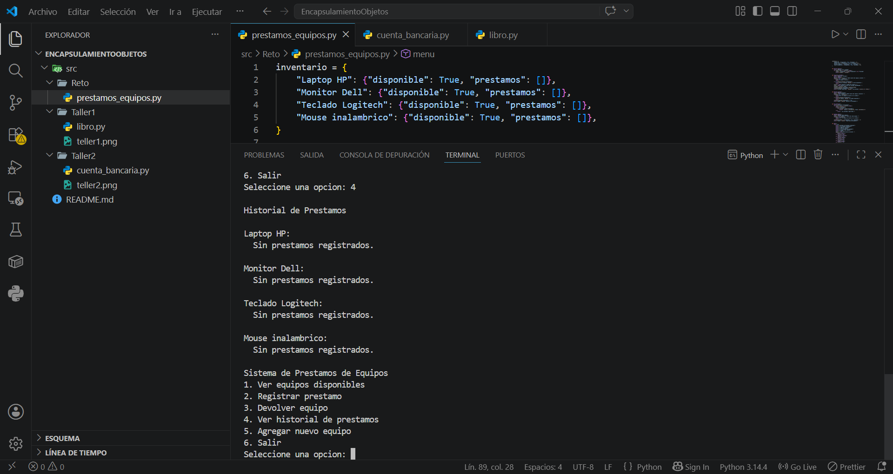
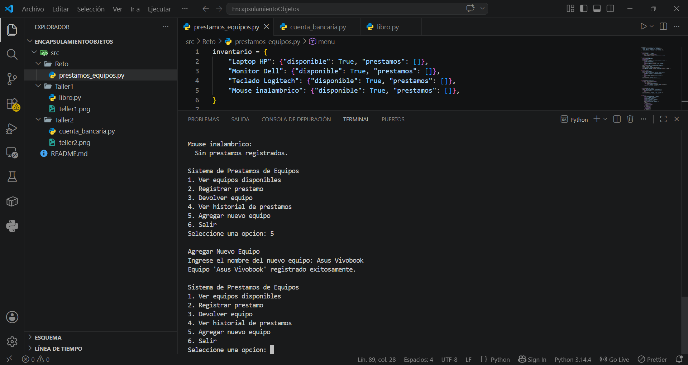

# Encapsulamiento y Objetos - Talleres Python

Proyectos para practicar Programación Orientada a Objetos en Python. Aquí aprendemos a crear clases, manejar objetos, proteger datos y organizar el código.

---

## Taller 1 - Clase Libro

**Archivo:** `src/Taller1/libro.py`

### Explicación del diseño de clases y encapsulación

Se creó una clase `Libro` que funciona como una plantilla para representar cualquier libro en una biblioteca. La clase tiene cuatro atributos: `titulo`, `autor`, `paginas` y `disponible`. Este último arranca en `True` (disponible) y cambia según las acciones que se realicen.

Los métodos que tiene son:
- `prestar()`: revisa si el libro está disponible. Si lo está, lo marca como prestado. Si no, avisa que no se puede.
- `devolver()`: hace lo contrario, revisa si estaba prestado y lo devuelve a disponible.
- `informacion()`: muestra todos los datos del libro y su estado actual.

La lógica de validación evita errores como prestar un libro dos veces o devolver uno que ya está disponible.

### Ejemplos de ejecución



### Reflexión personal sobre aprendizajes y retos superados

- Entendí que una clase es como un molde y los objetos son las cosas que creamos con ese molde. Cada libro tiene sus propios datos y puede hacer sus propias acciones sin mezclarse con los demás.
- Aprendí que con `self` le decimos al código "esto le pertenece a este objeto", así cada libro sabe si está prestado o no sin confundirse.
- Vi lo importante que es preguntar antes de hacer: el programa siempre revisa si puede prestar o devolver antes de ejecutar el cambio.
- Me di cuenta de que el constructor `__init__` nos permite definir cómo queremos que sea un libro desde el momento en que lo creamos.

---

## Taller 2 - Clase CuentaBancaria

**Archivo:** `src/Taller2/cuenta_bancaria.py`

### Explicación del diseño de clases y encapsulación

Se creó una clase `CuentaBancaria` que protege sus datos internos usando encapsulación. El titular y el saldo están definidos con un guion bajo (`_titular` y `_saldo`) para indicar que son datos internos que no deberían tocarse directamente.

Se usaron propiedades (`@property`) para controlar el acceso:
- `titular` es de solo lectura: se puede ver pero no cambiar.
- `saldo` tiene validación: no puede ser negativo, si se intenta asigna un saldo negativo, lanza un error.
- `depositar()`: aumenta el saldo solo si la cantidad es positiva.
- `retirar()`: disminuye el saldo solo si hay suficiente dinero.

### Ejemplos de ejecución



### Reflexión personal sobre aprendizajes y retos superados

- Aprendí a "esconder" datos dentro de una clase con el guion bajo. Es como decirle a otros programadores "esto es interno, no lo toques".
- Las propiedades son una forma elegante de poner reglas: accedo a un dato como si fuera público, pero por dentro el programa está haciendo validaciones.
- Hacer que el titular sea de solo lectura tiene sentido: en la vida real el dueño de una cuenta no debería cambiar así nomás.
- Usar `True` o `False` como respuesta en depositar y retirar es práctico: el programa que usa la clase sabe al instante si la operación funcionó.
- La regla más importante que protegemos es que el saldo nunca sea negativo.

---

## Reto - Sistema de Préstamos de Equipos

**Archivo:** `src/Reto/prestamos_equipos.py`

### Explicación del diseño de clases y encapsulación

Este programa es un sistema completo para manejar el inventario de equipos de una institución. Usa tres formas de guardar información:

- **Diccionario**: funciona como catálogo principal. Cada equipo tiene su nombre como llave, y como valor tiene su estado (disponible/prestado) y su historial de préstamos.
- **Listas**: guardan el historial de préstamos de cada equipo. Como son listas, podemos agregar nuevos préstamos cuando se registren.
- **Tuplas**: cada préstamo es una tupla `(usuario, fecha)`. Al ser inmutable, una vez registrado no se puede modificar, manteniendo la integridad del historial.

El programa tiene un menú interactivo con estas opciones:
1. Ver equipos disponibles
2. Registrar préstamo
3. Devolver equipo
4. Ver historial de préstamos
5. Agregar nuevo equipo
6. Salir

Cada opción tiene validaciones: no se puede prestar un equipo que no existe, no se puede prestar algo ya prestado, no se puede agregar un equipo duplicado, etc.

### Ejemplos de ejecución






### Reflexión personal sobre aprendizajes y retos superados

- Usar un diccionario como catálogo principal es muy práctico: busco cualquier equipo por su nombre al instante y veo toda su info.
- Las tuplas me sirven para el historial porque, una vez que guardo un préstamo, ese registro no debería cambiar nunca. Es como firmar un documento.
- Dividir el programa en funciones separadas (una para cada acción) hace que sea más fácil de entender y de arreglar si algo sale mal.
- El menú con un ciclo que se repite hasta que el usuario dice "salir" es la base de muchos programas que usamos todos los días.
- Las validaciones son clave: siempre revisar antes de hacer, así evitamos comportamientos raros.
- Aunque es un programa sencillo, la idea de tener un inventario central y funciones que lo manejan es la misma que usan los sistemas grandes con bases de datos.

---

## Cómo ejecutar

```bash
# Taller 1 - Clase Libro
python src/Taller1/libro.py

# Taller 2 - CuentaBancaria
python src/Taller2/cuenta_bancaria.py

# Reto - Sistema de Préstamos
python src/Reto/prestamos_equipos.py
```
